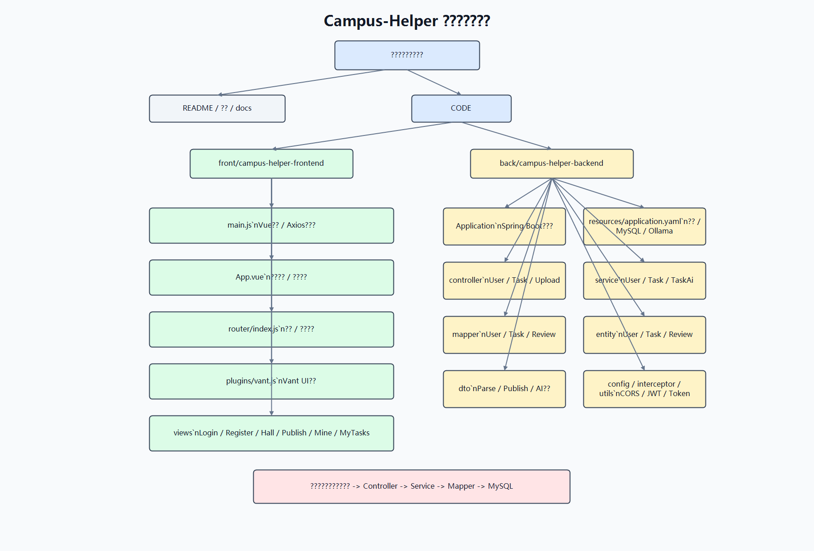
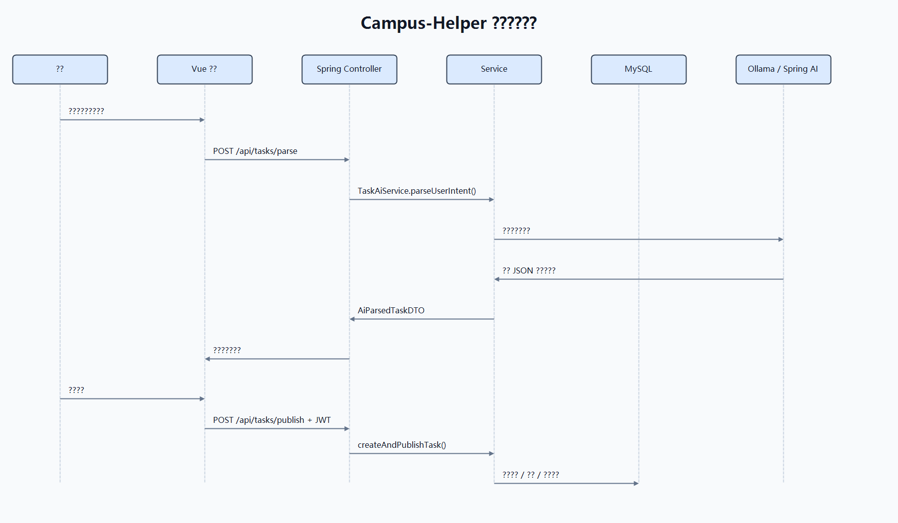
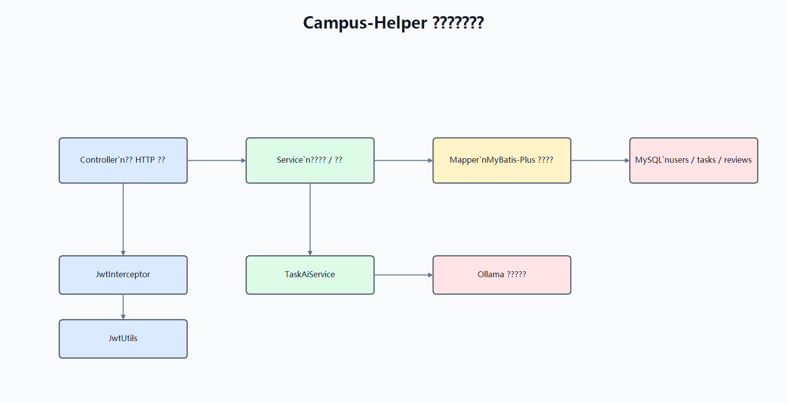
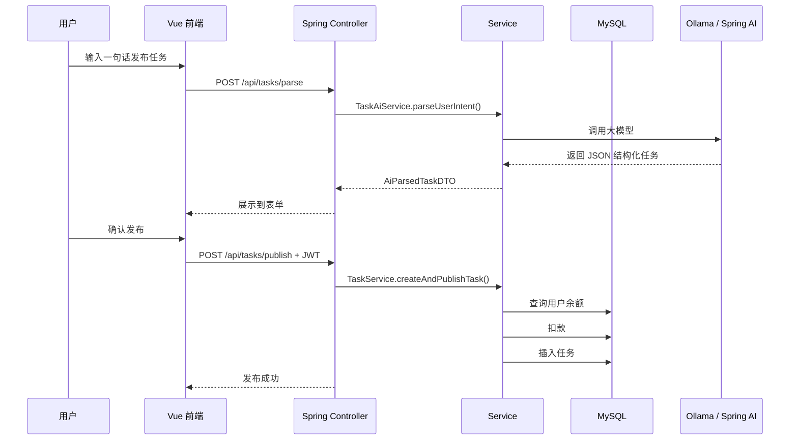
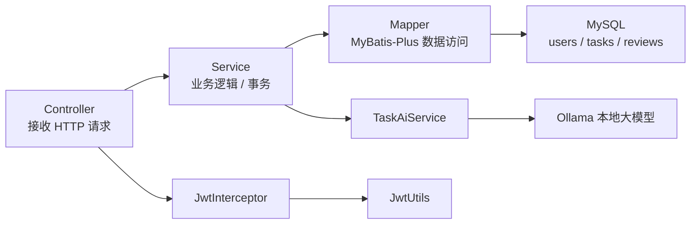

# Campus-Helper 项目代码结构图

## PNG 图片版

## 代码基本结构

```mermaid
flowchart TD
    A["企业级架构应用开发"] --> B["README / 报告 / docs"]
    A --> C["CODE"]

    C --> D["front/campus-helper-frontend"]
    C --> E["back/campus-helper-backend"]

    D --> D1["src/main.js<br/>Vue 应用入口<br/>Axios 全局拦截器"]
    D --> D2["src/App.vue<br/>页面容器 + 底部 Tabbar"]
    D --> D3["src/router/index.js<br/>路由配置 + 登录守卫"]
    D --> D4["src/plugins/vant.js<br/>Vant UI 注册"]
    D --> D5["src/views"]

    D5 --> V1["Login.vue<br/>登录"]
    D5 --> V2["Register.vue<br/>注册"]
    D5 --> V3["TaskHall.vue<br/>任务大厅 / 抢单"]
    D5 --> V4["PublishPage.vue<br/>AI 解析 / 发布任务 / 上传图片"]
    D5 --> V5["MyTasks.vue<br/>我发布的 / 我接单的 / 完成评价"]
    D5 --> V6["Mine.vue<br/>个人中心"]

    E --> E1["CampusHelperBackendApplication.java<br/>Spring Boot 启动类"]
    E --> E2["controller<br/>接口层"]
    E --> E3["service<br/>业务层"]
    E --> E4["mapper<br/>数据库访问层"]
    E --> E5["entity<br/>数据库实体"]
    E --> E6["dto<br/>请求/AI 数据对象"]
    E --> E7["config / interceptor / utils<br/>配置、鉴权、工具"]
    E --> E8["resources/application.yaml<br/>端口、MySQL、Ollama 配置"]

    E2 --> C1["UserController<br/>登录 / 注册 / 用户信息"]
    E2 --> C2["TaskController<br/>AI解析 / 发布 / 列表 / 抢单 / 完成"]
    E2 --> C3["UploadController<br/>图片上传"]

    E3 --> S1["UserService<br/>注册登录逻辑"]
    E3 --> S2["TaskService<br/>发单扣款 / 抢单 / 完成结算 / 信用分"]
    E3 --> S3["TaskAiService<br/>调用 Ollama 解析自然语言"]

    E4 --> M1["UserMapper"]
    E4 --> M2["TaskMapper"]
    E4 --> M3["ReviewMapper"]

    E5 --> EN1["User"]
    E5 --> EN2["Task"]
    E5 --> EN3["Review"]

    E6 --> DTO1["TaskParseRequest"]
    E6 --> DTO2["TaskPublishRequest"]
    E6 --> DTO3["AiParsedTaskDTO"]

    E7 --> CFG1["WebConfig<br/>CORS / JWT 拦截 / uploads 静态映射"]
    E7 --> CFG2["JwtInterceptor<br/>校验 Authorization"]
    E7 --> CFG3["JwtUtils<br/>生成/解析 Token"]
```

## 核心调用链

## 后端分层关系

## 阅读路径建议

1. 先看前端路由：`CODE/front/campus-helper-frontend/src/router/index.js`
2. 再看页面入口：`Login.vue`、`TaskHall.vue`、`PublishPage.vue`、`MyTasks.vue`
3. 后端从 `TaskController.java` 进入业务接口
4. 任务主逻辑看 `TaskService.java`
5. AI 解析逻辑看 `TaskAiService.java`
6. 鉴权逻辑看 `WebConfig.java`、`JwtInterceptor.java`、`JwtUtils.java`
