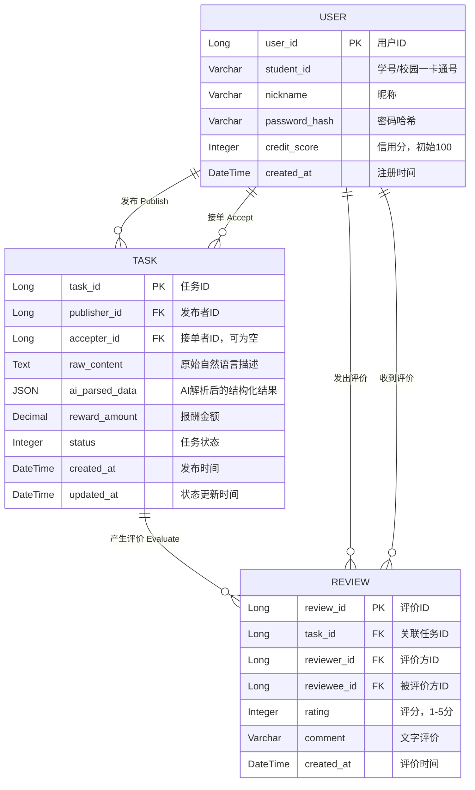

```mermaid
erDiagram
    USER {
        Long user_id PK "用户ID"
        Varchar student_id "学号/校园一卡通号"
        Varchar nickname "昵称"
        Varchar password_hash "密码哈希"
        Integer credit_score "信用分，初始100"
        DateTime created_at "注册时间"
    }

    TASK {
        Long task_id PK "任务ID"
        Long publisher_id FK "发布者ID"
        Long accepter_id FK "接单者ID，可为空"
        Text raw_content "原始自然语言描述"
        JSON ai_parsed_data "AI解析后的结构化结果"
        Decimal reward_amount "报酬金额"
        Integer status "任务状态"
        DateTime created_at "发布时间"
        DateTime updated_at "状态更新时间"
    }

    REVIEW {
        Long review_id PK "评价ID"
        Long task_id FK "关联任务ID"
        Long reviewer_id FK "评价方ID"
        Long reviewee_id FK "被评价方ID"
        Integer rating "评分，1-5分"
        Varchar comment "文字评价"
        DateTime created_at "评价时间"
    }

    USER ||--o{ TASK : "发布 Publish"
    USER ||--o{ TASK : "接单 Accept"
    TASK ||--o{ REVIEW : "产生评价 Evaluate"
    USER ||--o{ REVIEW : "发出评价"
    USER ||--o{ REVIEW : "收到评价"

```
