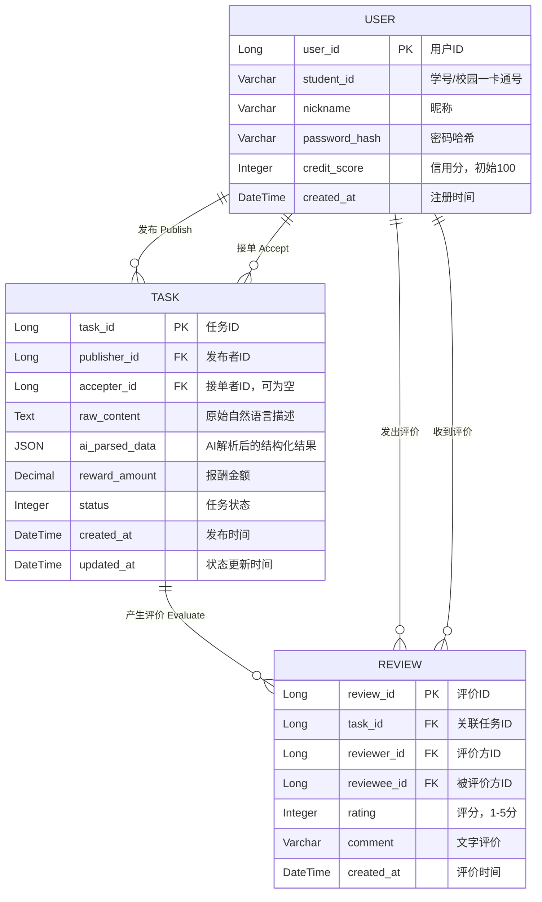

### 1. 核心实体与属性设计

**实体 1：用户 (User)** 系统的基本参与者，既可以发布需求，也可以接取任务。

- **user_id** (主键, Long)
    
- **student_id** (学号, Varchar，例如 11 位长度的校园一卡通号)
    
- **nickname** (昵称, Varchar)
    
- **password_hash** (密码哈希, Varchar)
    
- **credit_score** (信用分, Integer，初始 100 分，评价会影响此分数，低于某阈值无法接单)
    
- **created_at** (注册时间, DateTime)
    

**实体 2：任务订单 (Task)** 系统的核心流转对象，也是体现大语言模型处理能力的重点实体。

- **task_id** (主键, Long)
    
- **publisher_id** (发布者ID, 外键关联 User)
    
- **accepter_id** (接单者ID, 外键关联 User，初始允许为空)
    
- **raw_content** (原始文本, Text，用户输入的非结构化自然语言描述，如“明天下午三点求人拿快递”)
    
- **ai_parsed_data** (AI解析结果, JSON，存储本地大模型提取出的结构化字段集合，如确切时间、地点、物品分类等)
    
- **reward_amount** (报酬金额, Decimal)
    
- **status** (任务状态, Integer/Enum，如：0-待接单，1-进行中，2-待确认，3-已完成，4-已取消)
    
- **created_at** (发布时间, DateTime)
    
- **updated_at** (状态更新时间, DateTime)
    

**实体 3：评价 (Review)** 任务完成后的信用闭环实体。

- **review_id** (主键, Long)
    
- **task_id** (关联任务ID, 外键关联 Task)
    
- **reviewer_id** (评价方ID, 外键关联 User)
    
- **reviewee_id** (被评价方ID, 外键关联 User)
    
- **rating** (评分, Integer，1-5分)
    
- **comment** (文字评价, Varchar)
    
- **created_at** (评价时间, DateTime)
    

### 2. 实体间的关系 (Relationships)

在绘制 ER 图的菱形（关系）时，可以这样梳理流转逻辑：

- **发布 (Publish)**：`User` 与 `Task` 之间是 **1:N** 的关系。一个用户可以发布多个任务。
    
- **接单 (Accept)**：`User` 与 `Task` 之间也是 **1:N** 的关系。一个用户可以接取多个任务。
    
- **评价 (Evaluate)**：`Task` 与 `Review` 之间通常是 **1:1** 或 **1:2**（如果设计为双向互评）。`User` 与 `Review` 是 **1:N** 的关系。



### 核心 Prompt 逻辑设计

```
# Role
你是一个校园帮办平台的智能意图识别引擎。你的任务是从用户的自然语言输入中，精准提取关键任务实体，并严格输出为 JSON 格式。

# Constraints
1. 必须且只能输出合法的 JSON 字符串，绝对不要包含任何前缀、后缀、解释性文本，也不要使用 Markdown 的 ```json 代码块包裹。
2. 如果用户没有提供某个字段的信息，请将该字段的值设为 null，不要自行捏造。
3. "reward" 字段只能提取纯数字（如有小数点保留两位），去掉“元”、“块”等单位。

# Output Schema
{
  "time": "任务的期望执行时间，例如：明天中午、2026-05-02 14:00",
  "location": "任务相关的具体地点，例如：南区快递点、三舍",
  "action": "具体的动作和对象，例如：拿大件快递、修电脑",
  "reward": "报酬金额纯数字，例如：5、10.5",
  "tags": ["任务的分类标签，输出 1-2 个，例如：代拿快递、跑腿、技能互助"]
}

# Examples
User Input: "明天下午三点求个同学帮我把一个大箱子从南门搬到三舍，报酬一杯奶茶（约15元）"
JSON Output: 
{
  "time": "明天下午三点",
  "location": "南门到三舍",
  "action": "搬大箱子",
  "reward": 15,
  "tags": ["体力帮办", "跑腿"]
}

User Input: "有没有会装系统的，来男生寝室帮个忙，重谢50"
JSON Output:
{
  "time": null,
  "location": "男生寝室",
  "action": "装系统",
  "reward": 50,
  "tags": ["技能互助", "电脑维修"]
}

# Task
现在，请解析以下用户输入，并仅返回 JSON 数据：
User Input: {user_input}
```

