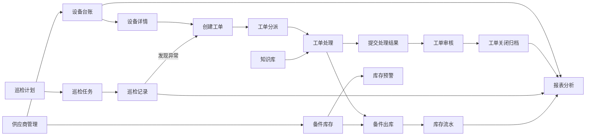

# 智慧园区设备运维管理平台需求说明书

## 一、文档说明

### 1.1 文档名称

智慧园区设备运维管理平台需求说明书

### 1.2 项目性质

本项目为智慧园区设备运维管理平台前端业务系统建设项目，当前交付范围为前端部分，但需要按照企业级前后端分离项目的方式设计业务页面、业务流程、接口结构、数据字典和 Mock 数据。

本版本需求文档聚焦设备运维业务功能、业务流程、业务接口和业务数据结构。

### 1.3 文档适用范围

本需求说明书适用于智慧园区设备运维管理平台的需求确认、前端开发、接口 Mock、业务验收和后续扩展设计。

### 1.4 配套材料

业务原型图目录：

[智慧园区设备运维管理原型界面](智慧园区设备运维管理原型界面)

逐图操作逻辑说明：

[界面操作逻辑说明.md](智慧园区设备运维管理原型界面/界面操作逻辑说明.md)

功能完备性分析与实体关系图：

[智慧园区设备运维管理平台-功能完备性分析与实体关系图.md](智慧园区设备运维管理平台-功能完备性分析与实体关系图.md)

权限方案：

[智慧园区设备运维管理平台-权限方案.md](智慧园区设备运维管理平台-权限方案.md)

---

## 二、项目概述

### 2.1 项目名称

智慧园区设备运维管理平台

### 2.2 项目背景

大型校园、产业园区、企业办公园区通常有大量设备需要长期维护，例如空调、电梯、门禁、摄像头、消防设备、网络设备、会议室设备和照明设备等。

传统管理方式下，设备台账、巡检记录、故障报修、维修工单、备件出入库和供应商信息往往分散在 Excel、纸质单据或多个系统中，容易出现信息不同步、工单处理慢、责任不清、库存预警滞后和数据统计困难等问题。

本项目要求开发一个面向园区运维场景的前端业务系统，用于统一管理设备资产、故障工单、巡检任务、备件库存、供应商信息、知识库和运维数据分析。

### 2.3 项目定位

本项目定位为企业级业务后台系统，采用前后端分离架构。

前端负责：

1. 业务页面展示
2. 业务交互流程
3. 路由组织
4. 状态管理
5. 接口调用封装
6. Mock 数据模拟
7. 数据可视化展示
8. 原型页面还原与业务逻辑实现

后端服务不在当前交付范围内，前端需要按照接口设计进行请求封装和 Mock 数据模拟。

---

## 三、建设目标

### 3.1 业务目标

1. 建立统一的设备台账管理入口。
2. 支持故障报修、工单创建、工单分派、维修处理、审核关闭和归档。
3. 支持巡检计划、巡检任务、巡检记录和检查项异常转工单。
4. 支持备件资料、入库、出库、库存流水和库存预警。
5. 支持供应商资料、联系人、关联设备和服务记录管理。
6. 支持知识库文章维护，沉淀常见故障处理方案。
7. 支持运维报表分析，展示设备、工单、巡检、库存等核心指标。

### 3.2 技术目标

1. 使用 Vue3 + Vite 搭建企业级前端工程。
2. 使用 Vue Router 完成多模块页面组织。
3. 使用 Pinia 管理业务状态、页面设置、筛选条件或字典数据。
4. 封装统一 API 请求层。
5. 使用 Mock 数据模拟真实后端接口。
6. 设计清晰的前端目录结构。
7. 完成可维护、可扩展的业务页面。

---

## 四、整体业务流程

### 4.1 主业务闭环

平台围绕“设备”展开，核心闭环如下：

1. 设备台账维护园区内所有设备基础资料。
2. 设备发生故障后创建工单。
3. 工单进入分派、处理、审核、关闭流程。
4. 工单处理过程中可能消耗备件并产生出库流水。
5. 巡检计划生成巡检任务。
6. 巡检任务执行后形成巡检记录。
7. 巡检发现异常时可转为工单。
8. 供应商与设备、备件、服务记录建立关联。
9. 知识库沉淀故障处理方案，辅助工单处理。
10. 报表分析从设备、工单、巡检、库存中汇总数据。

### 4.2 总体流程图



### 4.3 工单业务流程

1. 从设备详情或工单管理页创建工单。
2. 填写故障设备、故障描述、优先级、报修信息。
3. 工单创建后进入待受理或待分派状态。
4. 主管在工单分派审核页选择处理人并确认分派。
5. 工单进入处理中状态。
6. 处理人填写故障原因、处理措施、现场图片、备件使用和处理结果。
7. 提交处理结果后，工单进入待审核状态。
8. 审核通过后工单进入已完成状态。
9. 工单关闭后归档，业务流程结束。
10. 审核驳回时，工单退回处理中，继续补充处理记录。

### 4.4 巡检业务流程

1. 创建巡检计划，配置巡检区域、设备类型、周期、负责人和检查项。
2. 根据巡检计划生成巡检任务。
3. 执行巡检任务，逐项填写检查结果。
4. 巡检正常时提交并生成巡检记录。
5. 巡检检查项异常时填写异常说明，并可转为工单。
6. 巡检记录进入归档，可从设备详情中查看。

### 4.5 库存业务流程

1. 维护备件基础资料和安全库存。
2. 采购到货后进行备件入库，生成入库流水。
3. 工单维修时选择备件并进行出库，生成出库流水。
4. 当前库存低于安全库存时进入库存预警。
5. 根据预警信息生成补货建议。
6. 库存数据进入报表分析。

---

## 五、业务模块说明

### 5.1 首页仪表盘

#### 参考原型图


#### 功能说明

首页用于展示平台核心运营数据，让使用者快速了解设备运行、工单处理、库存预警和近期动态。

#### 页面内容

1. 设备总数
2. 在线设备数
3. 故障设备数
4. 今日新增工单数
5. 待处理工单数
6. 本月完成工单数
7. 工单状态分布图
8. 设备类型分布图
9. 最近工单动态
10. 库存预警列表

#### 操作要求

1. 点击故障设备卡片，跳转设备台账并筛选故障设备。
2. 点击待处理工单卡片，跳转工单管理并筛选待处理工单。
3. 点击库存预警，跳转库存预警页。
4. 点击最近工单动态，跳转工单详情页。

---

### 5.2 设备台账

#### 参考原型图


#### 功能说明

设备台账用于统一维护园区设备资产信息，是工单、巡检、库存和供应商关联的核心基础数据。

#### 核心功能

1. 设备列表
2. 设备详情
3. 新增设备
4. 编辑设备
5. 删除设备
6. 设备状态变更
7. 设备二维码展示
8. 设备维修历史查看
9. 设备巡检记录查看

#### 查询条件

1. 设备名称
2. 设备编号
3. 设备类型
4. 所在区域
5. 设备状态
6. 负责人

#### 设备字段

1. 设备编号
2. 设备名称
3. 设备类型
4. 品牌型号
5. 所在区域
6. 安装位置
7. 负责人
8. 供应商
9. 购买日期
10. 保修截止日期
11. 当前状态
12. 创建时间

#### 操作要求

1. 设备列表支持查询、重置、分页、新增、详情、编辑、删除。
2. 设备详情展示基础信息、维修历史、巡检记录和备件使用。
3. 从设备详情可以直接创建工单。
4. 删除设备前需要二次确认。
5. 如设备存在未关闭工单，前端应提示不允许删除。

---

### 5.3 工单管理

#### 参考原型图


#### 功能说明

工单管理用于管理设备故障报修和维修处理流程，是本项目最核心的业务流程模块。

#### 核心功能

1. 工单列表
2. 创建工单
3. 编辑工单
4. 工单详情
5. 分派工单
6. 接单或开始处理
7. 更新处理进度
8. 记录备件使用
9. 提交处理结果
10. 审核工单
11. 关闭工单
12. 工单流转记录
13. 工单附件管理

#### 查询条件

1. 工单编号
2. 工单标题
3. 工单状态
4. 优先级
5. 报修人
6. 处理人
7. 创建时间范围

#### 工单状态

1. 待受理
2. 待分派
3. 处理中
4. 待审核
5. 已完成
6. 已关闭
7. 已驳回

#### 优先级

1. 低
2. 中
3. 高
4. 紧急

#### 操作要求

1. 待受理或待分派工单可进入分派流程。
2. 处理中工单可保存进度、使用备件、提交处理结果。
3. 待审核工单可审核通过或驳回。
4. 已关闭工单只允许查看，不允许继续处理。
5. 工单状态变化需要追加流转记录。
6. 工单处理使用备件时，需要同步生成库存出库流水。
7. 创建工单、处理工单、提交工单结果时可上传现场照片、维修凭证等附件。
8. 附件需要记录所属业务对象、文件名称、文件类型、文件大小和访问地址。

---

### 5.4 巡检管理

#### 参考原型图


#### 功能说明

巡检管理用于维护巡检计划、执行巡检任务并归档巡检记录。巡检检查项异常可转为维修工单。

#### 核心功能

1. 巡检计划列表
2. 新增巡检计划
3. 编辑巡检计划
4. 设备分类检查项模板配置
5. 启用或停用巡检计划
6. 巡检任务列表
7. 填写巡检结果
8. 巡检附件管理
9. 查看巡检记录
10. 异常巡检转工单

#### 巡检计划字段

1. 计划名称
2. 巡检区域
3. 巡检设备类型
4. 巡检周期
5. 负责人
6. 启用状态
7. 下次执行时间
8. 检查项配置

#### 巡检结果

1. 正常
2. 异常
3. 待复查

#### 操作要求

1. 巡检计划支持新增、编辑、启用、停用。
2. 停用的巡检计划不再生成新的巡检任务。
3. 检查项模板绑定设备分类维护，检查项模板至少包含检查项名称、标准要求、排序号和是否必填。
4. 新增或编辑巡检计划时选择巡检设备分类，系统根据设备分类带出对应检查项模板。
5. 根据巡检计划生成巡检任务时，需要把设备分类下启用的检查项模板复制为本次任务的巡检检查项。
6. 巡检任务执行时需要逐项填写检查结果。
7. 异常检查项必须填写异常说明。
8. 巡检执行过程中可上传现场照片、异常图片或处理凭证等附件。
9. 异常巡检可一键转为工单。
10. 巡检完成后生成巡检记录，并可在设备详情中查看。

---

### 5.5 备件库存

#### 参考原型图


#### 功能说明

备件库存用于管理维修过程中使用的备件资料、库存数量、入库出库流水和低库存预警。

#### 核心功能

1. 备件列表
2. 新增备件
3. 编辑备件
4. 入库登记
5. 出库登记
6. 库存流水
7. 库存预警
8. 补货建议

#### 备件字段

1. 备件编号
2. 备件名称
3. 备件类型
4. 规格型号
5. 当前库存
6. 安全库存
7. 单位
8. 存放位置
9. 供应商

#### 操作要求

1. 备件列表支持查询、分页、新增、编辑、入库、出库和查看流水。
2. 入库会增加当前库存并生成入库流水。
3. 出库会减少当前库存并生成出库流水。
4. 出库数量不能大于当前库存。
5. 当前库存小于安全库存时进入库存预警。
6. 库存流水只允许查询和导出，不建议删除。

---

### 5.6 供应商管理

#### 参考原型图


#### 功能说明

供应商管理用于维护设备供应商、备件供应商和维保服务商信息，并与设备、备件和服务记录建立关联。

#### 核心功能

1. 供应商列表
2. 新增供应商
3. 编辑供应商
4. 禁用供应商
5. 查看关联设备
6. 查看联系人信息
7. 查看服务记录

#### 供应商字段

1. 供应商名称
2. 供应商类型
3. 联系人
4. 联系电话
5. 邮箱
6. 地址
7. 服务范围
8. 合作状态

#### 操作要求

1. 供应商列表支持查询、分页、新增、详情、编辑和禁用。
2. 禁用供应商前需要二次确认。
3. 已禁用供应商不应出现在新增设备或新增备件时的可选供应商列表中。
4. 供应商详情可查看关联设备、服务记录、合同信息和联系人。
5. 供应商详情中的关联设备可跳转设备详情。

---

### 5.7 知识库

#### 参考原型图


#### 功能说明

知识库用于沉淀常见故障处理方案和设备维护文档，辅助运维人员快速定位问题和处理工单。

#### 核心功能

1. 知识文章列表
2. 文章搜索
3. 文章分类
4. 新增文章
5. 编辑文章
6. 查看文章详情
7. 文章预览
8. 按设备类型关联文章

#### 文章字段

1. 标题
2. 分类
3. 关联设备类型
4. 内容
5. 标签
6. 维护人
7. 更新时间
8. 发布状态

#### 操作要求

1. 知识库支持按关键词、分类、标签、设备类型筛选文章。
2. 文章可保存草稿，也可发布。
3. 草稿文章可编辑和预览。
4. 已发布文章可在工单处理和设备详情中作为参考资料。
5. 文章详情可跳转关联设备或关联工单。

---

### 5.8 报表分析

#### 参考原型图


#### 功能说明

报表分析用于展示设备和运维数据统计，帮助管理者了解设备故障趋势、工单处理效率、库存消耗和区域风险。

#### 核心功能

1. 工单趋势分析
2. 工单状态统计
3. 设备故障排行
4. 区域故障分布
5. 运维人员处理效率统计
6. 库存消耗统计

#### 操作要求

1. 支持按日期范围筛选。
2. 支持按区域筛选。
3. 支持按设备类型筛选。
4. 至少包含 4 个图表。
5. 图表数据来自 Mock 统计接口。
6. 设备故障排行中点击设备编号可跳转设备详情。

---

## 六、页面清单

| 模块 | 页面名称 | 路由建议 | 说明 |
|---|---|---|---|
| 首页 | 数据概览 | `/ops/dashboard` | 运维核心指标 |
| 设备台账 | 设备列表 | `/ops/devices` | 查询和维护设备 |
| 设备台账 | 设备详情 | `/ops/devices/:id` | 查看设备详情 |
| 设备台账 | 设备新增编辑 | `/ops/devices/form` | 新增或编辑设备 |
| 工单管理 | 工单列表 | `/ops/work-orders` | 查询和处理工单 |
| 工单管理 | 工单详情 | `/ops/work-orders/:id` | 查看工单详情和时间线 |
| 工单管理 | 创建工单 | `/ops/work-orders/create` | 创建维修工单 |
| 工单管理 | 工单处理 | `/ops/work-orders/:id/process` | 填写处理过程 |
| 工单管理 | 工单分派审核 | `/ops/work-orders/dispatch-review` | 分派和审核工单 |
| 巡检管理 | 巡检计划 | `/ops/inspections/plans` | 管理巡检计划 |
| 巡检管理 | 巡检任务 | `/ops/inspections/tasks` | 执行巡检任务 |
| 巡检管理 | 巡检记录详情 | `/ops/inspections/records/:id` | 查看巡检归档记录 |
| 库存管理 | 备件列表 | `/ops/inventory/parts` | 维护备件信息 |
| 库存管理 | 备件新增编辑 | `/ops/inventory/parts/form` | 新增或编辑备件 |
| 库存管理 | 备件出入库操作 | `/ops/inventory/parts/:id/stock-operation` | 备件入库或出库，也可实现为弹窗 |
| 库存管理 | 库存流水 | `/ops/inventory/records` | 查看入库出库记录 |
| 库存管理 | 库存预警 | `/ops/inventory/warnings` | 查看低库存预警 |
| 供应商 | 供应商列表 | `/ops/suppliers` | 维护供应商 |
| 供应商 | 供应商详情 | `/ops/suppliers/:id` | 查看供应商关联信息 |
| 供应商 | 供应商新增编辑 | `/ops/suppliers/form` | 新增或编辑供应商 |
| 知识库 | 知识文章 | `/ops/knowledge` | 维护故障处理文档 |
| 知识库 | 文章详情 | `/ops/knowledge/:id` | 查看文章详情 |
| 知识库 | 文章编辑 | `/ops/knowledge/form` | 新增或编辑文章 |
| 报表分析 | 运维报表 | `/ops/reports` | 数据可视化 |

---

## 七、工程要求

### 7.1 总体要求

本项目必须严格基于以下全栈框架进行开发，不允许另起独立工程：

```text
H:\教学课件\2026\重庆交通大学\前后端全栈框架
```

前端开发基于：

```text
H:\教学课件\2026\重庆交通大学\前后端全栈框架\Web\playground
```

后端开发基于：

```text
H:\教学课件\2026\重庆交通大学\前后端全栈框架\Java
```

### 7.2 前端工程要求

前端必须遵循 `Web\playground` 现有目录、别名、请求封装、路由注册和模块拆分规范。OPS 业务不得新建独立前端项目，应在现有 playground 中按业务模块扩展。

推荐落位：

```text
Web\playground\src
├─ api
│  └─ ops
│     ├─ dashboard.ts
│     ├─ device.ts
│     ├─ work-order.ts
│     ├─ inspection.ts
│     ├─ inventory.ts
│     ├─ supplier.ts
│     ├─ knowledge.ts
│     └─ report.ts
├─ enums
│  └─ ops.ts
├─ views
│  └─ ops
│     ├─ dashboard
│     ├─ devices
│     ├─ work-orders
│     ├─ inspections
│     ├─ inventory
│     ├─ suppliers
│     ├─ knowledge
│     └─ reports
└─ router
```

前端接口文件应参考 `src\api\ops\test.ts`、`src\api\hrm\schedule-plan.ts` 的写法，统一使用 `requestClient`，业务接口基础路径使用 `/ops/...`，例如：

```ts
export const BASE_URL = '/ops/devices';
```

前端页面应放在 `src\views\ops` 下，路由统一使用 `/ops` 前缀，例如 `/ops/devices`、`/ops/work-orders`、`/ops/inspections/tasks`。

### 7.3 后端工程要求

后端必须遵循 `Java` 目录下现有 Maven 多模块规范，不允许把 OPS 业务代码混入其他业务模块。

API 服务模块要求：

```text
Java\agilefast-platform\agilefast-ops-api
```

说明：当前框架中已存在 `agilefast-ops-api` 示例模块，应优先在该模块内扩展 OPS 接口。如果本地框架版本不存在该模块，则应在 `Java\agilefast-platform` 下新增 `agilefast-ops-api` 模块，并按父级 `pom.xml` 规范接入。

业务实体与领域能力模块要求：

```text
Java\agilefast-biz
```

如果 OPS 业务需要沉淀独立业务实体、领域服务、通用业务能力，应在 `Java\agilefast-biz` 下按现有 `agilefast-biz-hrm`、`agilefast-biz-plm` 等模块规范新增 `agilefast-biz-ops`，不得散落在平台 API 模块中。

后端包结构应参考现有 OPS 示例：

```text
io.agilefast.modules.ops
├─ controller
├─ entity
├─ mapper
├─ service
└─ config
```

接口 Controller 的基础路径必须使用 `/ops` 前缀，例如：

```java
@RequestMapping("/ops/devices")
```

### 7.4 必须体现的工程能力

1. 多业务模块路由组织。
2. 统一请求封装。
3. Mock 数据模拟。
4. 全局错误提示。
5. 表格查询分页。
6. 表单校验。
7. 图表展示。
8. 状态管理。
9. 本地持久化页面设置或筛选条件。
10. 公共组件复用。
11. 前后端接口路径一致。
12. 业务模块按 OPS 模块边界组织。

### 7.5 建议封装的公共组件

1. 查询表单组件
2. 分页表格组件
3. 状态标签组件
4. 详情信息块组件
5. 时间线组件
6. 图表卡片组件
7. 表单抽屉或弹窗组件
8. 空状态组件

---

## 八、接口设计约定

### 8.1 基础约定

接口统一前缀：

```text
/ops
```

请求数据格式：

```text
application/json
```

前端可先使用 Mock 数据模拟接口返回，后续应按相同接口路径与后端 OPS 模块联调。

### 8.2 通用响应结构

```json
{
  "code": 200,
  "message": "success",
  "data": {},
  "timestamp": 1778100000000
}
```

### 8.3 分页响应结构

```json
{
  "code": 200,
  "message": "success",
  "data": {
    "items": [],
    "total": 100
  },
  "timestamp": 1778100000000
}
```

### 8.4 常见状态码

| code | 含义 | 前端处理 |
|---:|---|---|
| 200 | 成功 | 正常渲染数据 |
| 400 | 参数错误 | 显示错误提示 |
| 404 | 资源不存在 | 显示不存在提示 |
| 500 | 服务端错误 | 显示系统异常提示 |

---

## 九、核心接口清单

### 9.1 首页接口

| 方法 | 地址 | 说明 |
|---|---|---|
| GET | `/ops/dashboard/summary` | 首页统计卡片 |
| GET | `/ops/dashboard/work-order-status` | 工单状态统计 |
| GET | `/ops/dashboard/device-category` | 设备类型统计 |
| GET | `/ops/dashboard/recent-activities` | 最近动态 |
| GET | `/ops/dashboard/inventory-warnings` | 库存预警 |

### 9.2 设备接口

| 方法 | 地址 | 说明 |
|---|---|---|
| GET | `/ops/devices` | 分页查询设备 |
| GET | `/ops/devices/{id}` | 查询设备详情 |
| POST | `/ops/devices` | 新增设备 |
| PUT | `/ops/devices/{id}` | 编辑设备 |
| DELETE | `/ops/devices/{id}` | 删除设备 |
| PATCH | `/ops/devices/{id}/status` | 修改设备状态 |
| GET | `/ops/devices/{id}/work-orders` | 查询设备维修历史 |
| GET | `/ops/devices/{id}/inspections` | 查询设备巡检记录 |
| GET | `/ops/devices/{id}/parts` | 查询设备备件使用记录 |

### 9.3 工单接口

| 方法 | 地址 | 说明 |
|---|---|---|
| GET | `/ops/work-orders` | 分页查询工单 |
| GET | `/ops/work-orders/{id}` | 查询工单详情 |
| POST | `/ops/work-orders` | 创建工单 |
| PUT | `/ops/work-orders/{id}` | 编辑工单 |
| POST | `/ops/work-orders/{id}/dispatch` | 分派工单 |
| POST | `/ops/work-orders/{id}/accept` | 接单或开始处理 |
| POST | `/ops/work-orders/{id}/progress` | 保存处理进度 |
| POST | `/ops/work-orders/{id}/submit` | 提交处理结果 |
| POST | `/ops/work-orders/{id}/approve` | 审核通过 |
| POST | `/ops/work-orders/{id}/reject` | 审核驳回 |
| POST | `/ops/work-orders/{id}/close` | 关闭工单 |
| GET | `/ops/work-orders/{id}/timeline` | 查询工单流转记录 |
| GET | `/ops/work-orders/{id}/attachments` | 查询工单附件 |
| POST | `/ops/work-orders/{id}/attachments` | 上传工单附件 |

### 9.4 巡检接口

| 方法     | 地址                                                      | 说明          |
| ------ | ------------------------------------------------------- | ----------- |
| GET    | `/ops/inspection-plans`                                 | 查询巡检计划      |
| POST   | `/ops/inspection-plans`                                 | 新增巡检计划      |
| PUT    | `/ops/inspection-plans/{id}`                            | 编辑巡检计划      |
| PATCH  | `/ops/inspection-plans/{id}/status`                     | 启用或停用计划     |
| GET    | `/ops/device-categories/{id}/inspection-template-items` | 查询设备分类检查项模板 |
| POST   | `/ops/device-categories/{id}/inspection-template-items` | 保存设备分类检查项模板 |
| DELETE | `/ops/inspection-template-items/{itemId}`               | 删除设备分类检查项模板 |
| GET    | `/ops/inspection-tasks`                                 | 查询巡检任务      |
| GET    | `/ops/inspection-tasks/{id}`                            | 查询巡检任务详情    |
| POST   | `/ops/inspection-tasks/{id}/save`                       | 保存巡检进度      |
| POST   | `/ops/inspection-tasks/{id}/submit`                     | 提交巡检结果      |
| POST   | `/ops/inspection-items/{id}/create-work-order`          | 检查项异常转工单    |
| GET    | `/ops/inspection-tasks/{id}/attachments`                | 查询巡检任务附件    |
| POST   | `/ops/inspection-tasks/{id}/attachments`                | 上传巡检任务附件    |
| GET    | `/ops/inspection-records/{id}`                          | 查询巡检记录详情    |

### 9.5 库存接口

| 方法 | 地址 | 说明 |
|---|---|---|
| GET | `/ops/spare-parts` | 查询备件 |
| GET | `/ops/spare-parts/{id}` | 查询备件详情 |
| POST | `/ops/spare-parts` | 新增备件 |
| PUT | `/ops/spare-parts/{id}` | 编辑备件 |
| POST | `/ops/spare-parts/{id}/inbound` | 入库 |
| POST | `/ops/spare-parts/{id}/outbound` | 出库 |
| GET | `/ops/inventory-records` | 查询库存流水 |
| GET | `/ops/inventory-warnings` | 查询库存预警 |
| POST | `/ops/inventory-warnings/{id}/purchase-suggestion` | 生成补货建议 |

### 9.6 供应商接口

| 方法 | 地址 | 说明 |
|---|---|---|
| GET | `/ops/suppliers` | 查询供应商 |
| GET | `/ops/suppliers/{id}` | 查询供应商详情 |
| POST | `/ops/suppliers` | 新增供应商 |
| PUT | `/ops/suppliers/{id}` | 编辑供应商 |
| PATCH | `/ops/suppliers/{id}/status` | 启用或禁用供应商 |
| GET | `/ops/suppliers/{id}/devices` | 查询关联设备 |
| GET | `/ops/suppliers/{id}/service-records` | 查询服务记录 |

### 9.7 知识库接口

| 方法 | 地址 | 说明 |
|---|---|---|
| GET | `/ops/knowledge/articles` | 查询文章列表 |
| GET | `/ops/knowledge/articles/{id}` | 查询文章详情 |
| POST | `/ops/knowledge/articles` | 新增文章 |
| PUT | `/ops/knowledge/articles/{id}` | 编辑文章 |
| POST | `/ops/knowledge/articles/{id}/publish` | 发布文章 |
| POST | `/ops/knowledge/articles/{id}/draft` | 保存草稿 |
| GET | `/ops/knowledge/categories` | 查询文章分类 |

### 9.8 报表接口

| 方法 | 地址 | 说明 |
|---|---|---|
| GET | `/ops/reports/work-order-trend` | 工单趋势 |
| GET | `/ops/reports/work-order-status` | 工单状态统计 |
| GET | `/ops/reports/device-fault-ranking` | 设备故障排行 |
| GET | `/ops/reports/area-fault-distribution` | 区域故障分布 |
| GET | `/ops/reports/engineer-efficiency` | 处理效率统计 |
| GET | `/ops/reports/inventory-consumption` | 库存消耗统计 |

---

## 十、数据库字典

说明：本项目只做前端开发，不要求真实建库。以下数据字典用于帮助前端理解业务字段、Mock 数据结构和接口字段设计。

### 10.0 通用字段

除特殊说明外，本章节中的所有业务表均默认包含以下通用字段。各业务表字段清单只列出业务字段，不再重复列出通用字段。

| 字段名 | 类型 | 必填 | 说明 |
|---|---|---|---|
| is_enable | int | 是 | 逻辑删除标记，0 表示正常，-1 表示已删除 |
| level_mark_id | bigint | 否 | 组织架构 ID |
| level_mark_value | varchar(255) | 否 | 组织架构值 |
| date_created | datetime | 是 | 创建时间 |
| modify_date | datetime | 是 | 修改时间 |
| created_by_id | bigint | 否 | 创建人 ID |
| created_by_name | varchar(50) | 否 | 创建人名称 |
| modify_by_id | bigint | 否 | 修改人 ID |
| modify_by_name | varchar(50) | 否 | 修改人名称 |

### 10.1 区域表 ops_area

| 字段名 | 类型 | 必填 | 说明 |
|---|---|---|---|
| id | bigint | 是 | 区域 ID |
| parent_id | bigint | 否 | 父级区域 |
| area_name | varchar(100) | 是 | 区域名称 |
| area_code | varchar(50) | 是 | 区域编码 |
| description | varchar(255) | 否 | 说明 |

### 10.2 设备分类表 ops_device_category

| 字段名 | 类型 | 必填 | 说明 |
|---|---|---|---|
| id | bigint | 是 | 分类 ID |
| category_name | varchar(100) | 是 | 分类名称 |
| category_code | varchar(50) | 是 | 分类编码 |
| parent_id | bigint | 否 | 父级分类 |
| description | varchar(255) | 否 | 说明 |

### 10.3 设备表 ops_device

| 字段名 | 类型 | 必填 | 说明 |
|---|---|---|---|
| id | bigint | 是 | 设备 ID |
| device_code | varchar(50) | 是 | 设备编号 |
| device_name | varchar(100) | 是 | 设备名称 |
| category_id | bigint | 是 | 设备分类 ID |
| category_name | varchar(100) | 否 | 设备分类名称 |
| brand | varchar(100) | 否 | 品牌 |
| model | varchar(100) | 否 | 型号 |
| area_id | bigint | 是 | 所在区域 ID |
| area_name | varchar(100) | 否 | 所在区域名称 |
| location | varchar(255) | 是 | 安装位置 |
| manager_id | bigint | 否 | 负责人 ID |
| manager_name | varchar(50) | 否 | 负责人名称 |
| supplier_id | bigint | 否 | 供应商 ID |
| supplier_name | varchar(100) | 否 | 供应商名称 |
| purchase_date | date | 否 | 购买日期 |
| warranty_end_date | date | 否 | 保修截止日期 |
| status | varchar(20) | 是 | running、fault、maintenance、scrapped |
| remark | varchar(500) | 否 | 备注 |

### 10.4 工单表 ops_work_order

| 字段名 | 类型 | 必填 | 说明 |
|---|---|---|---|
| id | bigint | 是 | 工单 ID |
| order_no | varchar(50) | 是 | 工单编号 |
| title | varchar(100) | 是 | 工单标题 |
| device_id | bigint | 是 | 关联设备 ID |
| device_name | varchar(100) | 否 | 关联设备名称 |
| source_type | varchar(30) | 是 | 工单来源，manual、inspection_item |
| source_id | bigint | 否 | 来源业务 ID，手动创建时为空，检查项异常转工单时为巡检检查项 ID |
| source_desc | varchar(255) | 否 | 来源说明 |
| reporter_id | bigint | 是 | 报修人 ID |
| reporter_name | varchar(50) | 是 | 报修人 |
| reporter_phone | varchar(20) | 否 | 报修联系电话 |
| assignee_id | bigint | 否 | 处理人 ID |
| assignee_name | varchar(50) | 否 | 处理人 |
| priority | varchar(20) | 是 | low、medium、high、urgent |
| status | varchar(30) | 是 | pending、assigned、processing、reviewing、completed、closed、rejected |
| description | text | 是 | 故障描述 |
| cause | text | 否 | 故障原因 |
| solution | text | 否 | 处理措施 |
| result | text | 否 | 处理结果 |
| report_time | datetime | 是 | 报修时间 |
| expected_finish_time | datetime | 否 | 期望完成时间 |
| finish_time | datetime | 否 | 完成时间 |

### 10.5 工单流转记录表 ops_work_order_timeline

| 字段名 | 类型 | 必填 | 说明 |
|---|---|---|---|
| id | bigint | 是 | 记录 ID |
| work_order_id | bigint | 是 | 工单 ID |
| operator_id | bigint | 是 | 操作人 ID |
| operator_name | varchar(50) | 是 | 操作人名称 |
| action | varchar(50) | 是 | 操作类型 |
| content | varchar(500) | 是 | 操作内容 |

### 10.6 巡检计划表 ops_inspection_plan

| 字段名 | 类型 | 必填 | 说明 |
|---|---|---|---|
| id | bigint | 是 | 计划 ID |
| plan_name | varchar(100) | 是 | 计划名称 |
| area_id | bigint | 是 | 巡检区域 |
| area_name | varchar(100) | 否 | 巡检区域名称 |
| category_id | bigint | 否 | 设备分类 |
| category_name | varchar(100) | 否 | 设备分类名称 |
| cycle_type | varchar(20) | 是 | daily、weekly、monthly |
| owner_id | bigint | 是 | 负责人 ID |
| owner_name | varchar(50) | 是 | 负责人 |
| next_execute_time | datetime | 否 | 下次执行时间 |
| status | varchar(20) | 是 | enabled、disabled |

### 10.7 设备分类检查项模板表 ops_inspection_plan_item

说明：该表用于维护设备分类下的标准检查项模板。巡检计划选择设备分类后，系统应根据该分类下启用的模板检查项生成巡检任务检查项，形成本次任务的实际检查结果记录。

| 字段名 | 类型 | 必填 | 说明 |
|---|---|---|---|
| id | bigint | 是 | 模板检查项 ID |
| category_id | bigint | 是 | 设备分类 ID |
| category_name | varchar(100) | 否 | 设备分类名称 |
| item_name | varchar(100) | 是 | 检查项名称 |
| standard | varchar(255) | 是 | 标准要求 |
| item_type | varchar(30) | 是 | text、number、select、photo |
| required | tinyint | 是 | 是否必填，1 是，0 否 |
| sort_order | int | 是 | 排序号 |
| enabled | tinyint | 是 | 是否启用，1 是，0 否 |
| remark | varchar(255) | 否 | 备注 |

### 10.8 巡检任务表 ops_inspection_task

| 字段名 | 类型 | 必填 | 说明 |
|---|---|---|---|
| id | bigint | 是 | 任务 ID |
| plan_id | bigint | 是 | 计划 ID |
| task_no | varchar(50) | 是 | 任务编号 |
| inspector_id | bigint | 是 | 巡检人 ID |
| inspector_name | varchar(50) | 是 | 巡检人 |
| status | varchar(20) | 是 | pending、processing、completed |
| result | varchar(20) | 否 | normal、abnormal、recheck |
| description | varchar(500) | 否 | 巡检说明 |
| related_order_id | bigint | 否 | 关联工单 ID |
| execute_time | datetime | 否 | 执行时间 |

### 10.9 巡检检查项表 ops_inspection_item

| 字段名 | 类型 | 必填 | 说明 |
|---|---|---|---|
| id | bigint | 是 | 检查项 ID |
| task_id | bigint | 是 | 巡检任务 ID |
| template_item_id | bigint | 否 | 来源模板检查项 ID |
| item_name | varchar(100) | 是 | 检查项 |
| standard | varchar(255) | 是 | 标准要求 |
| result | varchar(20) | 否 | normal、abnormal、recheck |
| abnormal_desc | varchar(500) | 否 | 异常说明 |

### 10.10 备件表 ops_spare_part

| 字段名 | 类型 | 必填 | 说明 |
|---|---|---|---|
| id | bigint | 是 | 备件 ID |
| part_code | varchar(50) | 是 | 备件编号 |
| part_name | varchar(100) | 是 | 备件名称 |
| part_type | varchar(50) | 是 | 备件类型 |
| model | varchar(100) | 否 | 规格型号 |
| stock_quantity | int | 是 | 当前库存 |
| safety_stock | int | 是 | 安全库存 |
| unit | varchar(20) | 是 | 单位 |
| location | varchar(100) | 否 | 存放位置 |
| supplier_id | bigint | 否 | 供应商 ID |
| supplier_name | varchar(100) | 否 | 供应商名称 |

### 10.11 库存流水表 ops_inventory_record

| 字段名 | 类型 | 必填 | 说明 |
|---|---|---|---|
| id | bigint | 是 | 流水 ID |
| record_no | varchar(50) | 是 | 流水编号 |
| part_id | bigint | 是 | 备件 ID |
| part_name | varchar(100) | 否 | 备件名称 |
| record_type | varchar(20) | 是 | inbound、outbound、adjust |
| quantity | int | 是 | 数量 |
| related_order_id | bigint | 否 | 关联工单 ID |
| operator_id | bigint | 是 | 操作人 ID |
| operator_name | varchar(50) | 是 | 操作人名称 |
| remark | varchar(255) | 否 | 备注 |

### 10.12 供应商表 ops_supplier

| 字段名 | 类型 | 必填 | 说明 |
|---|---|---|---|
| id | bigint | 是 | 供应商 ID |
| supplier_name | varchar(100) | 是 | 供应商名称 |
| supplier_type | varchar(50) | 是 | device、maintenance、part |
| contact_name | varchar(50) | 是 | 联系人 |
| contact_phone | varchar(20) | 是 | 联系电话 |
| email | varchar(100) | 否 | 邮箱 |
| address | varchar(255) | 否 | 地址 |
| service_scope | varchar(500) | 否 | 服务范围 |
| status | varchar(20) | 是 | enabled、disabled |

### 10.13 知识库文章表 ops_knowledge_article

| 字段名 | 类型 | 必填 | 说明 |
|---|---|---|---|
| id | bigint | 是 | 文章 ID |
| title | varchar(100) | 是 | 标题 |
| category | varchar(50) | 是 | 分类 |
| device_category_id | bigint | 否 | 关联设备分类 |
| device_category_name | varchar(100) | 否 | 关联设备分类名称 |
| content | text | 是 | 内容 |
| tags | varchar(255) | 否 | 标签 |
| maintainer_id | bigint | 否 | 文章维护人 ID |
| maintainer_name | varchar(50) | 否 | 文章维护人 |
| status | varchar(20) | 是 | draft、published |

### 10.14 附件表 ops_attachment

说明：该表为通用业务附件表，用于统一记录工单图片、巡检照片、巡检异常图片、知识库附件等文件信息。当前前端可使用 Mock URL 模拟文件上传结果。

| 字段名 | 类型 | 必填 | 说明 |
|---|---|---|---|
| id | bigint | 是 | 附件 ID |
| biz_type | varchar(50) | 是 | 业务类型，work_order、inspection_task、inspection_item、knowledge_article |
| biz_id | bigint | 是 | 业务数据 ID |
| file_name | varchar(255) | 是 | 原始文件名 |
| file_type | varchar(50) | 是 | image、document、video、other |
| file_ext | varchar(20) | 否 | 文件扩展名 |
| file_size | bigint | 是 | 文件大小，单位 byte |
| file_url | varchar(500) | 是 | 文件访问地址 |
| thumbnail_url | varchar(500) | 否 | 缩略图地址 |
| upload_scene | varchar(50) | 否 | 上传场景，如 report、process、result、inspection、article |
| description | varchar(255) | 否 | 附件说明 |
| uploader_id | bigint | 否 | 上传人 ID |
| uploader_name | varchar(50) | 否 | 上传人名称 |

---

## 十一、业务字典

### 11.1 设备状态

| 字典值 | 显示文本 | 说明 |
|---|---|---|
| running | 正常运行 | 设备可正常使用 |
| fault | 故障 | 设备存在故障 |
| maintenance | 维修中 | 设备正在维修 |
| scrapped | 已报废 | 设备已退出使用 |

### 11.2 工单状态

| 字典值 | 显示文本 | 说明 |
|---|---|---|
| pending | 待受理 | 工单刚创建 |
| assigned | 已分派 | 已指定处理人 |
| processing | 处理中 | 运维人员正在处理 |
| reviewing | 待审核 | 处理结果等待审核 |
| completed | 已完成 | 工单处理完成 |
| closed | 已关闭 | 工单归档关闭 |
| rejected | 已驳回 | 审核未通过 |

### 11.3 工单优先级

| 字典值 | 显示文本 | 说明 |
|---|---|---|
| low | 低 | 普通问题 |
| medium | 中 | 常规问题 |
| high | 高 | 影响业务使用 |
| urgent | 紧急 | 严重影响安全或核心业务 |

### 11.4 工单来源类型

适用字段：`ops_work_order.source_type`。

| 字典值 | 显示文本 | 说明 |
|---|---|---|
| manual | 手动创建 | 人工报修或从设备详情页手动创建工单，`source_id` 为空 |
| inspection_item | 检查项异常 | 巡检检查项异常转工单，`source_id` 为巡检检查项 ID |

### 11.5 巡检结果

| 字典值 | 显示文本 | 说明 |
|---|---|---|
| normal | 正常 | 检查结果正常 |
| abnormal | 异常 | 发现异常 |
| recheck | 待复查 | 需要后续复查 |

### 11.6 库存流水类型

| 字典值 | 显示文本 | 说明 |
|---|---|---|
| inbound | 入库 | 增加库存 |
| outbound | 出库 | 减少库存 |
| adjust | 调整 | 库存盘点或修正 |

### 11.7 文章状态

| 字典值 | 显示文本 | 说明 |
|---|---|---|
| draft | 草稿 | 未发布 |
| published | 已发布 | 可作为处理参考 |

### 11.8 启停状态

适用字段：`ops_inspection_plan.status`、`ops_supplier.status`。

| 字典值 | 显示文本 | 说明 |
|---|---|---|
| enabled | 启用 | 当前数据可正常使用 |
| disabled | 停用 | 当前数据暂停使用 |

### 11.9 巡检周期

适用字段：`ops_inspection_plan.cycle_type`。

| 字典值 | 显示文本 | 说明 |
|---|---|---|
| daily | 每日 | 每天生成或执行巡检任务 |
| weekly | 每周 | 每周生成或执行巡检任务 |
| monthly | 每月 | 每月生成或执行巡检任务 |

### 11.10 巡检任务状态

适用字段：`ops_inspection_task.status`。

| 字典值 | 显示文本 | 说明 |
|---|---|---|
| pending | 待巡检 | 巡检任务已生成但尚未开始 |
| processing | 巡检中 | 巡检任务正在执行 |
| completed | 已完成 | 巡检任务已提交并归档 |

### 11.11 供应商类型

适用字段：`ops_supplier.supplier_type`。

| 字典值 | 显示文本 | 说明 |
|---|---|---|
| device | 设备供应商 | 提供设备采购或设备安装服务 |
| maintenance | 维保服务商 | 提供维修、保养或巡检服务 |
| part | 备件供应商 | 提供维修备件或耗材 |

### 11.12 备件类型

适用字段：`ops_spare_part.part_type`。

| 字典值 | 显示文本 | 说明 |
|---|---|---|
| consumable | 消耗品 | 维修过程中会持续消耗的材料 |
| electrical | 电气备件 | 电源、开关、线缆、控制器等电气类备件 |
| mechanical | 机械备件 | 轴承、阀门、密封件等机械类备件 |
| network | 网络备件 | 网线、交换机模块、摄像头配件等网络类备件 |
| safety | 安防消防备件 | 门禁、消防、报警相关备件 |
| tool | 工具器具 | 维修工具、检测工具或辅助器具 |

### 11.13 备件单位

适用字段：`ops_spare_part.unit`。

| 字典值 | 显示文本 | 说明 |
|---|---|---|
| piece | 个 | 单个备件 |
| set | 套 | 成套备件或工具 |
| box | 盒 | 盒装耗材 |
| meter | 米 | 线缆、管材等按长度计量的备件 |
| roll | 卷 | 卷装材料 |
| bottle | 瓶 | 液体、胶水等瓶装耗材 |

### 11.14 工单流转动作

适用字段：`ops_work_order_timeline.action`。

| 字典值 | 显示文本 | 说明 |
|---|---|---|
| create | 创建工单 | 新建维修工单 |
| dispatch | 分派工单 | 指定工单处理人 |
| accept | 接单处理 | 处理人开始处理工单 |
| progress | 保存进度 | 记录维修过程或阶段性处理说明 |
| submit | 提交处理 | 提交故障原因、处理措施和处理结果 |
| approve | 审核通过 | 工单处理结果审核通过 |
| reject | 审核驳回 | 工单处理结果被驳回，需要继续处理 |
| close | 关闭归档 | 工单完成并归档 |

### 11.15 知识库文章分类

适用字段：`ops_knowledge_article.category`。

| 字典值 | 显示文本 | 说明 |
|---|---|---|
| fault_guide | 故障处理 | 常见故障原因和处理方案 |
| maintenance_manual | 维护手册 | 设备日常维护和保养说明 |
| inspection_standard | 巡检标准 | 巡检检查项、判断标准和注意事项 |
| operation_guide | 操作指南 | 设备操作、系统操作或流程说明 |
| safety_notice | 安全注意事项 | 安全风险、应急处理和注意事项 |

### 11.16 巡检模板检查项类型

适用字段：`ops_inspection_plan_item.item_type`。

| 字典值 | 显示文本 | 说明 |
|---|---|---|
| text | 文本填写 | 检查时填写文字说明 |
| number | 数值填写 | 检查时填写数值，例如温度、电压、压力 |
| select | 选项选择 | 检查时选择预设结果 |
| photo | 拍照上传 | 检查时必须上传现场照片 |

### 11.17 附件业务类型

适用字段：`ops_attachment.biz_type`。

| 字典值 | 显示文本 | 说明 |
|---|---|---|
| work_order | 工单附件 | 关联维修工单 |
| inspection_task | 巡检任务附件 | 关联一次巡检任务 |
| inspection_item | 巡检检查项附件 | 关联巡检任务中的某个检查项 |
| knowledge_article | 知识库附件 | 关联知识库文章 |

### 11.18 附件文件类型

适用字段：`ops_attachment.file_type`。

| 字典值 | 显示文本 | 说明 |
|---|---|---|
| image | 图片 | jpg、png、webp 等图片文件 |
| document | 文档 | pdf、doc、docx、xls、xlsx 等文档文件 |
| video | 视频 | mp4、mov 等视频文件 |
| other | 其他 | 无法归类到以上类型的文件 |

### 11.19 附件上传场景

适用字段：`ops_attachment.upload_scene`。

| 字典值 | 显示文本 | 说明 |
|---|---|---|
| report | 报修现场 | 创建工单时上传的现场图片或凭证 |
| process | 处理过程 | 工单处理过程中上传的过程图片或凭证 |
| result | 处理结果 | 工单提交处理结果时上传的结果凭证 |
| inspection | 巡检现场 | 巡检执行时上传的现场照片或异常图片 |
| article | 知识文章 | 知识库文章中引用或附加的文件 |

---

## 十二、非功能需求

### 12.1 易用性

1. 页面布局清晰，符合企业后台系统使用习惯。
2. 常用操作入口明显。
3. 列表页支持查询、重置、分页和操作反馈。
4. 表单校验信息明确。
5. 删除、关闭、审核、禁用等关键操作需要二次确认。
6. 业务状态需要使用标签或颜色进行区分。

### 12.2 性能

1. 路由页面使用懒加载。
2. 大型列表采用分页查询。
3. 图表和复杂组件按需加载。
4. Mock 数据量应能覆盖分页、筛选和状态切换测试。

### 12.3 可维护性

1. 页面、组件、接口、状态、工具函数分层清晰。
2. 公共逻辑应抽取为 composables 或 utils。
3. API 接口统一管理。
4. 字典值统一维护。
5. 样式变量统一管理。
6. 业务模块之间避免循环依赖。

---

## 十三、交付要求

### 13.1 必须交付

1. 基于 `Web\playground` 扩展的 OPS 前端源码。
2. 基于 `Java\agilefast-platform\agilefast-ops-api` 扩展的 OPS 接口源码。
3. 按规范落位的 OPS 业务实体、Mapper、Service、Controller 等代码。
4. README 项目说明。
5. 前端接口封装代码。
6. 主要业务页面和业务交互。
7. 图表展示和状态流转模拟。
8. 必要的 Mock 数据或本地模拟数据。

### 13.2 README 建议内容

1. 项目简介
2. 框架目录说明
3. 启动方式
4. 目录结构
5. 功能模块说明
6. 接口路径说明
7. 业务流程说明
8. 后续可扩展方向

### 13.3 当前阶段可简化内容

1. 文件上传可先使用 Mock URL 或本地模拟地址。
2. 报表统计可先使用模拟聚合数据。
3. 短信、邮件等第三方服务不在当前范围。
4. 复杂流程提醒、消息推送可预留接口，不要求完整实现。

---

## 十四、建议实现优先级

### 14.1 第一阶段：基础框架

1. 熟悉全栈框架目录结构。
2. 接入 OPS 前端菜单和路由。
3. 建立 `src\api\ops` 接口文件。
4. 建立 `src\views\ops` 页面目录。
5. 接入 `agilefast-ops-api` 后端接口模块。
6. 准备 Mock 基础数据。

### 14.2 第二阶段：核心业务

1. 首页仪表盘。
2. 设备台账。
3. 工单管理。
4. 工单详情和状态流转。
5. 工单处理和备件出库联动。

### 14.3 第三阶段：扩展业务

1. 巡检管理。
2. 备件库存。
3. 供应商管理。
4. 知识库。

### 14.4 第四阶段：企业化完善

1. 报表分析。
2. 公共组件抽取。
3. 字典统一维护。
4. 页面细节优化。
5. README 和演示材料整理。

---

## 十五、验收检查项

项目完成时应重点检查以下内容：

1. 项目是否能正常启动。
2. 设备、工单、巡检、库存等核心页面是否具备完整交互。
3. 工单状态流转是否符合业务流程。
4. 巡检检查项异常转工单是否能形成闭环。
5. 备件出入库是否能影响库存数量和库存预警。
6. 请求封装和 Mock 数据是否与接口设计一致。
7. 页面结构是否具有企业后台系统特征。
8. 组件拆分是否合理。
9. 数据字典和接口字段是否在前端中得到体现。
10. README 是否能支持项目运行、功能理解和后续维护。
