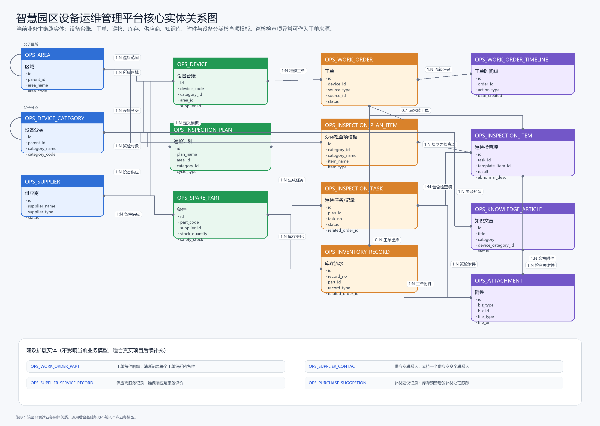

# 智慧园区设备运维管理平台功能完备性分析与实体关系图

## 一、分析结论

当前功能设计可以支撑一个完整可运行的前端业务系统。项目可基于现有需求说明、页面清单、接口清单、数据字典和原型图，完成 Vue3 + Vite 前端工程搭建、路由组织、接口封装、Mock 数据、列表查询、表单维护、流程流转和图表展示。

如果按真实企业项目交付标准评估，当前版本属于“业务主链路完整、生产支撑能力适度简化”的设计。它已经覆盖设备运维业务的核心闭环，并已纳入附件统一管理和设备分类检查项模板。若未来接入真实后端和真实数据，还可继续补充备件领用明细、供应商联系人、补货建议、服务记录等扩展实体。

当前版本暂不包含通用后台基础配置页面，以下分析只围绕业务功能、业务数据和业务流程进行评估。

## 二、整体业务闭环

当前设计形成了以下业务闭环：

1. 设备台账作为核心基础数据，关联区域、设备分类、供应商、工单、巡检记录和备件使用记录。
2. 工单管理覆盖创建、分派、处理、提交、审核、关闭和时间线归档。
3. 巡检管理覆盖计划配置、任务生成、任务执行、记录归档和检查项异常转工单。
4. 备件库存覆盖备件资料、入库、出库、库存流水和库存预警。
5. 供应商管理覆盖供应商资料、关联设备、关联备件和服务信息展示。
6. 知识库覆盖文章列表、文章详情、文章编辑、发布和设备分类关联。
7. 报表分析从设备、工单、巡检、库存等数据中汇总指标，支撑运营分析。

因此，按企业级前端业务系统目标判断，当前设计可以作为一个完整可运行的业务应用进行开发。

## 三、模块完备性评估

| 模块 | 当前完备度 | 是否阻塞前端实现 | 说明 |
|---|---|---|---|
| 首页仪表盘 | 完整 | 否 | 已有统计卡片、趋势图、状态分布、库存预警和近期动态接口。 |
| 设备台账 | 完整 | 否 | 已有列表、详情、新增编辑、状态维护、维修历史、巡检记录和备件使用入口。 |
| 工单管理 | 完整 | 否 | 已覆盖工单主流程、详情时间线、创建、处理、分派、审核、关闭。 |
| 巡检管理 | 完整 | 否 | 已覆盖计划、任务、执行、记录详情和检查项异常转工单。 |
| 备件库存 | 完整 | 否 | 已覆盖备件资料、出入库、库存流水、库存预警和补货建议入口。 |
| 供应商管理 | 基本完整 | 否 | 已覆盖供应商资料、详情、关联设备和服务记录；联系人目前作为供应商字段承载。 |
| 知识库 | 完整 | 否 | 已覆盖列表、详情、编辑、草稿、发布和设备分类关联。 |
| 报表分析 | 基本完整 | 否 | 已提供核心报表接口；真实项目中还需进一步定义每个指标的统计口径。 |

## 四、完整可运行性判断

### 4.1 可以完整运行的范围

按业务系统交付要求，当前设计已经足够完成以下内容：

1. 业务菜单与路由跳转。
2. 设备、工单、巡检、库存、供应商、知识库的 CRUD 或状态流转。
3. 表格分页、条件查询、详情查看、表单校验。
4. 工单状态流转和巡检检查项异常转工单。
5. 库存出入库流水和库存预警。
6. 首页和报表图表展示。
7. 基于 Mock 数据或后端接口联调的完整前端演示。

### 4.2 不影响当前版本但后续建议补充的内容

以下内容不影响当前业务系统运行，但如果扩展为更完整的生产级运维平台，建议在后续版本中补充：

| 建议补充项 | 建议实体 | 原因 |
|---|---|---|
| 工单备件明细 | `ops_work_order_part` | 当前库存流水可记录工单出库，但无法清晰展示一个工单消耗了哪些备件。 |
| 供应商联系人 | `ops_supplier_contact` | 当前供应商表只适合保存主联系人，多联系人场景需要独立表。 |
| 供应商服务记录 | `ops_supplier_service_record` | 供应商详情页需要稳定的数据来源展示维保、响应、服务评价等记录。 |
| 补货建议记录 | `ops_purchase_suggestion` | 库存预警生成补货建议后，应能追踪建议状态和处理结果。 |

## 五、页面清单与原型图核对

### 5.1 核对结论

“六、页面清单”共 24 个业务页面。当前需求文档已引用 25 张原型图，原型目录中也存在 25 张 PNG 文件，图片链接均有效。页面清单中的业务页面均已有对应原型承载，不需要额外补图。

其中，“巡检计划”和“巡检任务”在原型上由 `06-巡检管理.png` 通过 Tab 聚合承载；“巡检任务执行”由 `14-巡检任务执行.png` 单独承载；“巡检计划新增编辑”由 `19-巡检计划新增编辑.png` 单独承载。这种设计符合当前需求，不属于缺失。

### 5.2 页面到原型图映射

| 页面名称 | 路由建议 | 对应原型图 | 覆盖状态 |
|---|---|---|---|
| 数据概览 | `/ops/dashboard` | `02-首页仪表盘.png` | 已覆盖 |
| 设备列表 | `/ops/devices` | `03-设备台账.png` | 已覆盖 |
| 设备详情 | `/ops/devices/:id` | `11-设备详情.png` | 已覆盖 |
| 设备新增编辑 | `/ops/devices/form` | `12-设备新增编辑.png` | 已覆盖 |
| 工单列表 | `/ops/work-orders` | `04-工单管理.png` | 已覆盖 |
| 工单详情 | `/ops/work-orders/:id` | `05-工单详情.png` | 已覆盖 |
| 创建工单 | `/ops/work-orders/create` | `13-创建工单.png` | 已覆盖 |
| 工单处理 | `/ops/work-orders/:id/process` | `18-工单处理.png` | 已覆盖 |
| 工单分派审核 | `/ops/work-orders/dispatch-review` | `21-工单分派审核.png` | 已覆盖 |
| 巡检计划 | `/ops/inspections/plans` | `06-巡检管理.png`、`19-巡检计划新增编辑.png` | 已覆盖 |
| 巡检任务 | `/ops/inspections/tasks` | `06-巡检管理.png`、`14-巡检任务执行.png` | 已覆盖 |
| 巡检记录详情 | `/ops/inspections/records/:id` | `22-巡检记录详情.png` | 已覆盖 |
| 备件列表 | `/ops/inventory/parts` | `07-备件库存.png` | 已覆盖 |
| 备件新增编辑 | `/ops/inventory/parts/form` | `23-备件新增编辑.png` | 已覆盖 |
| 备件出入库操作 | `/ops/inventory/parts/:id/stock-operation` | `20-备件出入库操作.png` | 已覆盖 |
| 库存流水 | `/ops/inventory/records` | `15-库存流水.png` | 已覆盖 |
| 库存预警 | `/ops/inventory/warnings` | `24-库存预警.png` | 已覆盖 |
| 供应商列表 | `/ops/suppliers` | `08-供应商管理.png` | 已覆盖 |
| 供应商详情 | `/ops/suppliers/:id` | `16-供应商详情.png` | 已覆盖 |
| 供应商新增编辑 | `/ops/suppliers/form` | `25-供应商新增编辑.png` | 已覆盖 |
| 知识文章 | `/ops/knowledge` | `09-知识库.png` | 已覆盖 |
| 文章详情 | `/ops/knowledge/:id` | `26-知识库文章详情预览.png` | 已覆盖 |
| 文章编辑 | `/ops/knowledge/form` | `17-知识库文章编辑.png` | 已覆盖 |
| 运维报表 | `/ops/reports` | `10-报表分析.png` | 已覆盖 |

## 六、核心实体关系图

图片文件：[entity-relationship-diagram.png](entity-relationship-diagram.png)

图源文件：[智慧园区设备运维管理平台-核心实体关系图.mmd](智慧园区设备运维管理平台-核心实体关系图.mmd)

## 七、实体关系说明

| 实体 | 作用 | 关键关系 |
|---|---|---|
| `ops_area` | 园区、楼栋、楼层、房间等空间层级 | 自关联形成区域树；区域下挂设备和巡检计划。 |
| `ops_device_category` | 设备分类体系 | 自关联形成分类树；分类下挂设备、巡检计划、检查项模板和知识文章。 |
| `ops_device` | 设备台账主实体 | 关联区域、分类、供应商；产生工单和巡检记录。 |
| `ops_work_order` | 故障维修流程主实体 | 关联设备；通过来源字段记录手动创建或检查项异常转工单；拥有流转时间线；处理过程可产生库存出库流水。 |
| `ops_work_order_timeline` | 工单流转记录 | 记录工单创建、分派、处理、提交、审核和关闭过程。 |
| `ops_inspection_plan` | 巡检计划 | 关联区域和设备分类；按周期生成巡检任务。 |
| `ops_inspection_plan_item` | 设备分类检查项模板 | 隶属于设备分类；生成巡检任务时按巡检计划的设备分类复制为任务检查项。 |
| `ops_inspection_task` | 巡检任务或巡检记录 | 来源于巡检计划；执行后形成归档记录。 |
| `ops_inspection_item` | 巡检检查项结果 | 隶属于巡检任务，记录每项检查结果和异常说明；异常时可作为工单来源。 |
| `ops_spare_part` | 备件资料 | 关联供应商；通过库存流水记录数量变化。 |
| `ops_inventory_record` | 库存流水 | 关联备件；出库时可关联维修工单。 |
| `ops_supplier` | 供应商资料 | 关联设备和备件。 |
| `ops_knowledge_article` | 知识库文章 | 可关联设备分类，用于沉淀故障处理方案。 |
| `ops_attachment` | 附件 | 通过业务类型和业务 ID 关联工单、巡检任务、巡检检查项和知识文章。 |

## 八、最终建议

当前版本适合作为中上复杂度的 Vue3 + Vite 企业级前端项目，不建议继续扩大业务范围。后续如果要提高实现质量，优先在现有范围内做好工程质量，例如模块化接口、Mock 数据一致性、状态流转校验、组件复用、图表封装和异常处理，而不是继续增加菜单。

若后续要升级为更接近生产的综合项目，建议按“小步扩展”的方式补充工单备件明细、供应商联系人、供应商服务记录和补货建议记录，不建议一次性加入过多通用后台能力。
